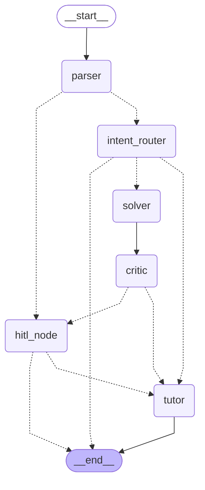

# 🎓 Multimodal Math Mentor

An AI-powered **JEE Mathematics Tutor** built with a multi-agent architecture using [LangGraph](https://github.com/langchain-ai/langgraph) and [Streamlit](https://streamlit.io/). The system accepts math problems via **text**, **image** (OCR), or **audio** (ASR), solves them step-by-step, verifies the solution, and explains it in a student-friendly manner — all with **Human-in-the-Loop (HITL)** oversight.

---

## ✨ Features

- **Multimodal Input** — Accepts math problems as text, images (via Mistral OCR), or audio recordings (via AssemblyAI ASR).
- **Multi-Agent Pipeline** — A LangGraph-powered state machine with specialized agents for parsing, routing, solving, verifying, and tutoring.
- **RAG-Augmented Solving** — Retrieval-Augmented Generation using a curated JEE Math knowledge base with ChromaDB and HuggingFace embeddings.
- **Wolfram Alpha Integration** — Symbolic and numerical computation via the Wolfram Alpha calculator tool.
- **Self-Learning Memory Bank** — Stores verified solutions in a persistent ChromaDB vector store for future reuse and pattern matching.
- **Human-in-the-Loop (HITL)** — Automatic escalation for low-confidence inputs or ambiguous solutions, with approve/edit/reject controls.
- **LaTeX-Rendered Explanations** — Tutor agent outputs step-by-step explanations with properly formatted LaTeX equations.
- **Streamlit UI** — Interactive web interface with real-time agent trace, confidence indicators, and feedback collection.

---

## 🏗️ Agent Architecture

The system is orchestrated as a **LangGraph StateGraph** with conditional routing between agents. Each agent reads from and writes to a shared `AgentState`.



> **Solid edges** represent unconditional transitions. **Dashed edges** represent conditional routing based on the agent state.

---

## 🤖 Agents — Detailed Breakdown

### 1. Parser Agent (`agents/parser_agent.py`)

The **entry point** of the pipeline. Takes raw text (from direct input, OCR, or ASR) and produces a structured representation.

| Field | Description |
|---|---|
| `parsed_topic` | The math topic (e.g., algebra, calculus, probability) |
| `parsed_variables` | Variables identified in the problem (e.g., `['x', 'y']`) |
| `parsed_constraints` | Constraints or conditions (e.g., `['x > 0']`) |
| `needs_clarification` | Boolean flag if the problem is unclear |

**Routing:** If confidence < 0.7 or `needs_clarification` is `True`, the workflow is routed to the **HITL Node** for human review. Otherwise, it proceeds to the **Intent Router**.

---

### 2. Intent Router Agent (`agents/intent_router_agent.py`)

Classifies the user's intent into one of three categories:

| Intent | Description |
|---|---|
| `solve_math` | The user wants to solve a specific math problem → routes to **Solver** |
| `explain_concept` | The user wants a conceptual explanation → routes directly to **Tutor** |
| `out_of_scope` | The query is unrelated to JEE Mathematics → terminates the workflow |

---

### 3. Solver Agent (`agents/solver_agent.py`)

The core problem-solving agent. It combines multiple knowledge sources to produce a solution:

- **RAG System** — Retrieves relevant context from the `knowledge_base/` directory (JEE Math reference documents) using ChromaDB + HuggingFace `all-MiniLM-L6-v2` embeddings.
- **Memory Bank** — Searches past verified solutions for similar problems to reuse patterns and correct known OCR/audio typos.
- **Wolfram Alpha Calculator Tool** — A LangChain tool that calls the Wolfram Alpha API for symbolic/numerical computation.

**Always routes to the Critic Agent** after producing a solution.

---

### 4. Critic Agent (`agents/critic_agent.py`)

A rigorous **Mathematics Verifier** that reviews the proposed solution against the original problem.

| Output | Description |
|---|---|
| `is_verified` | `True` if the solution is mathematically correct |
| `verification_feedback` | Detailed critique or `"All good."` |
| `needs_hitl` | `True` if the problem is highly ambiguous or the verifier is unsure |

After verification, the solution is automatically saved to the **Memory Bank** for future self-learning.

**Routing:** If `needs_hitl` is `True` or the user requests a recheck → **HITL Node**. Otherwise → **Tutor**.

---

### 5. HITL Node (`agents/hitl_node.py`)

A **Human-in-the-Loop interrupt node** using LangGraph's `interrupt()` mechanism. When triggered, the workflow pauses and presents the current state to a human reviewer via the Streamlit UI.

The reviewer can:
| Action | Effect |
|---|---|
| **✅ Approve** | Accept the solution as-is and proceed to the Tutor |
| **✏️ Edit** | Modify the solution and proceed to the Tutor |
| **❌ Reject** | Reject the solution entirely and terminate the workflow |

Approved/edited solutions are saved to the Memory Bank with human feedback metadata.

---

### 6. Tutor Agent (`agents/tutor_agent.py`)

The **final agent** in the pipeline. Receives the original problem, the verified solution, and the critic's notes, then produces a **step-by-step, student-friendly explanation**.

- Uses a supportive, pedagogical tone explaining *why* each step is taken.
- Highlights key JEE concepts and common pitfalls.
- Formats all equations in **LaTeX** (`$inline$` and `$$display$$`).

---

### Shared State (`agents/state.py`)

All agents communicate through a shared `AgentState` TypedDict:

```python
class AgentState(TypedDict):
    id: str
    text_input: str
    confidence: Optional[float]
    parsed_topic: Optional[str]
    parsed_variables: Optional[List[str]]
    parsed_constraints: Optional[List[str]]
    needs_clarification: Optional[bool]
    intent: Optional[str]
    retrieved_context: Optional[str]
    past_similar_problems: Optional[str]
    solution: Optional[str]
    is_verified: Optional[bool]
    verification_feedback: Optional[str]
    needs_hitl: Optional[bool]
    tutor_explanation: Optional[str]
    user_requests_recheck: Optional[bool]
```

### LLM Configuration (`agents/llm.py`)

All agents use a shared LLM instance powered by **Groq** (`ChatGroq`) with the `openai/gpt-oss-20b` model at `temperature=0` for deterministic outputs.

---

## 🛠️ Utilities

| Module | Description |
|---|---|
| `utils/ocr.py` | **OCR** — Uses Mistral AI's OCR API (`mistral-ocr-latest`). Includes FFT-based blur detection and image sharpening with OpenCV before extraction. |
| `utils/asr.py` | **ASR** — Uses AssemblyAI's `universal-3-pro` speech model with automatic language detection. Returns transcription text and word-level confidence. |
| `utils/rag.py` | **RAG** — Loads `.txt` files from `knowledge_base/`, chunks them with `RecursiveCharacterTextSplitter`, and indexes them in ChromaDB with HuggingFace `all-MiniLM-L6-v2` embeddings. |
| `utils/memory_bank.py` | **Memory Bank** — Persistent ChromaDB vector store (`chroma_memory_db/`) that saves and retrieves past verified solutions with metadata (context, verifier feedback, human feedback). |

---

## 📂 Directory Structure

```
Multimodal-Math-Mentor/
├── agents/
│   ├── state.py                 # Shared AgentState TypedDict
│   ├── llm.py                   # Groq LLM initialization
│   ├── parser_agent.py          # Parser agent — structures raw input
│   ├── intent_router_agent.py   # Intent router — classifies user intent
│   ├── solver_agent.py          # Solver agent — RAG + Wolfram Alpha + Memory
│   ├── critic_agent.py          # Critic agent — verifies solutions
│   ├── tutor_agent.py           # Tutor agent — generates explanations
│   └── hitl_node.py             # Human-in-the-Loop interrupt node
├── knowledge_base/              # Curated JEE Math reference documents (txt files)
├── utils/
│   ├── ocr.py                   # Mistral OCR with blur detection
│   ├── asr.py                   # AssemblyAI ASR transcription
│   ├── rag.py                   # RAG system with ChromaDB
│   └── memory_bank.py           # Persistent memory bank
├── graph.py                     # LangGraph workflow definition
├── main.py                      # Streamlit application entrypoint
├── .env.example                 # Environment variable template
├── pyproject.toml               # Project metadata & dependencies
├── uv.lock                      # uv lock file
└── requirements.txt             # Pip-compatible requirements
```

---

## 🚀 Getting Started

### Prerequisites

- **Python 3.12+**
- [**uv**](https://docs.astral.sh/uv/) — Fast Python package manager (recommended)

### 1. Clone the Repository

```bash
git clone https://github.com/kevin-291/Multimodal-Math-Mentor.git
cd Multimodal-Math-Mentor
```

### 2. Set Up Environment Variables

Copy the example environment file and fill in your API keys:

```bash
cp .env.example .env
```

Edit `.env` with your credentials:

```dotenv
GROQ_API_KEY = "<your_groq_api_key_here>"
ASSEMBLYAI_API_KEY = "<your_assemblyai_api_key_here>"
MISTRAL_API_KEY = "<your_mistral_api_key_here>"
WOLFRAM_ALPHA_APPID = "<your_wolfram_alpha_app_id_here>"
```

| Key | Service | Used By |
|---|---|---|
| `GROQ_API_KEY` | [Groq](https://console.groq.com/) | All LLM-based agents (Parser, Intent Router, Solver, Critic, Tutor) |
| `ASSEMBLYAI_API_KEY` | [AssemblyAI](https://www.assemblyai.com/) | Audio transcription (ASR) |
| `MISTRAL_API_KEY` | [Mistral AI](https://console.mistral.ai/) | Image OCR extraction |
| `WOLFRAM_ALPHA_APPID` | [Wolfram Alpha](https://products.wolframalpha.com/api) | Mathematical computation tool in the Solver agent |

### 3. Install Dependencies with uv

This project uses [**uv**](https://docs.astral.sh/uv/) for fast, reproducible dependency management. The `pyproject.toml` defines all dependencies and `uv.lock` ensures deterministic builds.

```bash
# Install uv (if not already installed)
curl -LsSf https://astral.sh/uv/install.sh | sh

# Sync the project (creates venv and installs all dependencies from uv.lock)
uv sync
```

<details>
<summary><b>Alternative: Install with pip</b></summary>

If you prefer not to use `uv`, a `requirements.txt` is also available:

```bash
python -m venv .venv
source .venv/bin/activate  # On Windows: .venv\Scripts\activate
pip install -r requirements.txt
```

</details>

### 4. Run the Application

```bash
uv run streamlit run main.py
```

Or if using pip:

```bash
streamlit run main.py
```

The Streamlit app will open in your browser (typically at `http://localhost:8501`).

---

## 📄 License

This project is open-source. Feel free to use, modify, and distribute.